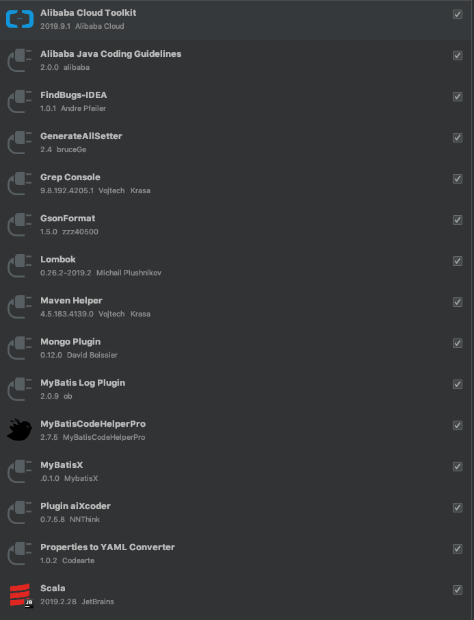
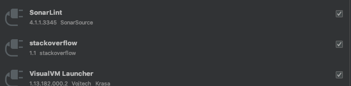

退后
`option + command + 左方向键`

向前
`option + command + 右方向键`

添加书签
`F11`

idea配置
>根目录下 settings.zip 文件




[同一项目多端口同时启动](https://blog.csdn.net/Poiscorpion/article/details/91892421)
VM配置参数 `-Dserver.port=9187`    

快捷键prsf  
```java
private static final
```
快捷键psf  
```java
public static final
```
快捷键psfs  
```java
public static final String
```
快捷键key  
```java
private static final String KEY_ = "";
```
快捷键main
```java
public static void main(String[] args) {
    
}
```

[edit template variables](http://www.jetbrains.com/help/idea/edit-template-variables-dialog.html#predefined_functions)  

[idea设置git仓库](https://www.jetbrains.com/help/idea/sharing-your-ide-settings.html#)      
```properties
https://github.com/caojing-github/idea.git
token
16986525cb88eb5896a4308919eaed21f33dd6d4
```

